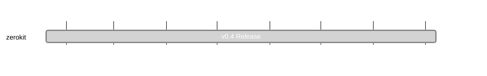

## `vac:acz:zerokit::vac:zerokit-v0.4`
---

- due: 2023/09/07
- status: 100%

### Description
- Release Planning - [Github Issue #197](https://github.com/vacp2p/zerokit/issues/197)

### Deliverables

* https://github.com/vacp2p/zerokit/releases/tag/v0.4.0

### Info

## 2023/08/14 - 2023/08/21

* substitute id_commitments for rate_commitments and update tests in rln-v2 - https://github.com/vacp2p/zerokit/pull/205
* rln-v2 working branch - https://github.com/vacp2p/zerokit/pull/204

## 2023/08/07 - 2023/08/14

* Serde api’s updated - https://github.com/vacp2p/zerokit/pull/202

## 2023/07/31 - 2023/08/07

* zerokit v0.4.0 release planning - https://github.com/vacp2p/zerokit/issues/197
