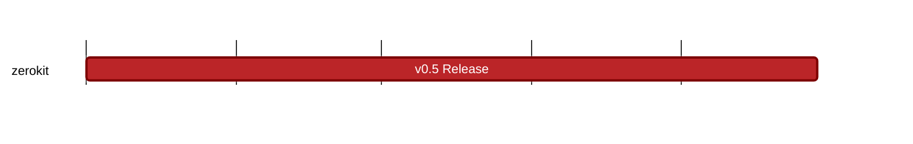

## `vac:acz:zerokit::vac:zerokit-v0.5`
---

- status: 5%
- CC: Aaryamann

### Description

* Release Planning issue:

* main focus: RLN performance improvements
  - explore using kzg proofs

### Deliverables

### Info

* We have a benchmarking suite done
