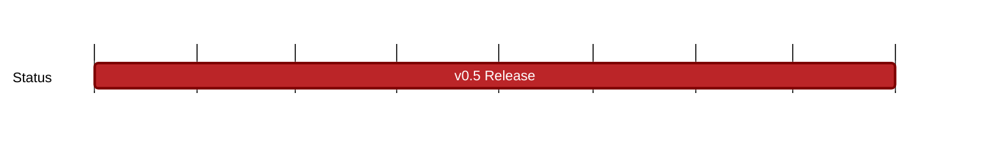

## `vac:acz:zerokit::vac:zerokit-v0.5`
---

- status: 30%
- CCs: 
	- Ekaterina
	- Aaryamann
### Description

* Release Planning issue: https://github.com/vacp2p/zerokit/issues/237

### Deliverables

- [x] https://github.com/vacp2p/zerokit/pull/239
- [x] https://github.com/vacp2p/zerokit/pull/242
- [x] https://github.com/vacp2p/zerokit/pull/243
- [x] https://github.com/vacp2p/zerokit/pull/245
- [x] https://github.com/vacp2p/zerokit/pull/246
