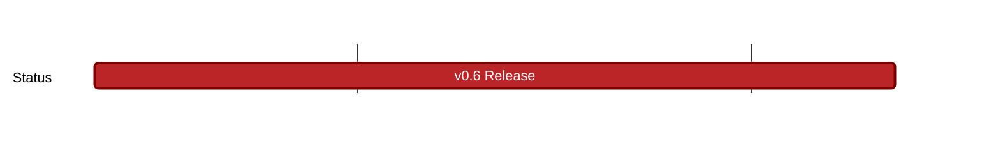

## `vac:acz:zerokit::vac:zerokit-v0.6`
---

- status: 0%
- CCs: 
	- Ekaterina

### Description

* Release Planning issue: https://github.com/vacp2p/zerokit/issues/263

This release's major feature is stateless RLN.

### Deliverables

