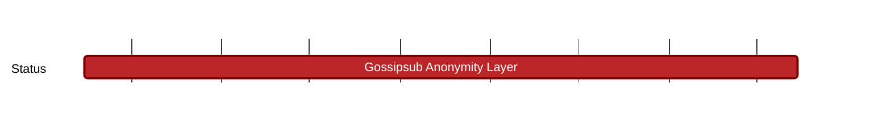

## `vac:dr:anon:vac:gossipsub-anonymity`
---

- status: 5%
- CC: Akshaya

### Description

This Milestone entails designing an anonymization layer for gossipsub, and by extension, IFT projects.
The primary objective of this anonymization layer is to serve as a cohesive anonymization solution for gossip-based projects,
with a specific focus on integrating it with the Logos projects Waku and Codex.

Currently, we're uncertain whether the complete anonymization layer can be situated between gossipsub and the protocols of IFT projects.
It appears more plausible that we'll establish a foundational element atop gossipsub,
with project-specific components integrated into the projects themselves,
or introduce an intermediary layer between the general gossip anonymization protocol and the project protocols.

The Nomos team is crafting their own anonymization solution due to their unique requirements and their ability to leverage specific traffic patterns to enhance efficiency.
Nonetheless, the overarching objective for our anonymization network is to render our solution modular, enabling the inclusion of traffic pattern plugins that Nomos can define.

Our initial exploration will revolve around extending our [Tor push proposal](https://rfc.vac.dev/spec/46/).
In this approach, messages will traverse through an anonymization network before being disseminated via gossip protocols upon exiting the anonymization network.
Additionally, we aim to investigate the concept of embedding anonymization capabilities directly into gossipsub,
rather than routing messages through a separate anonymization network before entering a standard gossipsub network operation.

Currently we view this anonymization solution as a P2P base layer, which the Vac P2P team will offer as part of libp2p.
This effort could potentially spawn an incubation project.
This effort would act as a basis for the Validator Privacy Network incubation project.

### Justification

Currently, IFT projects do not provide enough anonymity guarantees.
Privacy protection, which entails anonymity, is part of the [logos manifesto](https://logos.co/manifesto/).

#### Deliverables

* report comparing various approaches to realizing a gossipsub anonymization layer for IFT projects
    - this might entail identifying the need for in-project components (see description)
    - has to provide arguments why the proposed approach is expected to provide sufficient anonymity guarantees
* document describing benefits for each of Waku, Status, Codex, and Nimbus
* Paper on arxiv.com
    - including security/privacy analysis
    - should offer improvements over Tor push.
    - spam protection (integrate RLN)
    - the proposed solution MUST be practically applicable, efficient, and relevant (product-market fit)
* draft specification of the base functionality (a usable subset of the functionality)
* PoC implementation of the base functionality

