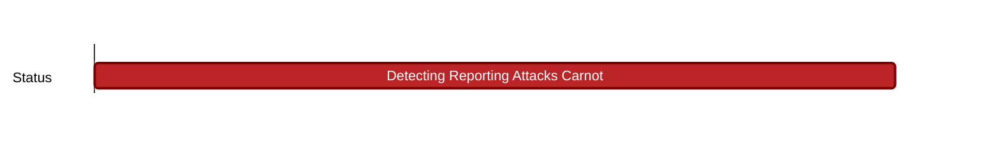

## `vac:dr:consensus:nomos:detecting-reporting-attacks-carnot`
---

- status: 0%
- CC: Moh

### Description

This research work will describe the mechanism of how various attacks can be detected,  reported, and slashed in the consensus.

### Justification

### Deliverables

* algorithm
* pseudocode
* spec
* rlog post

