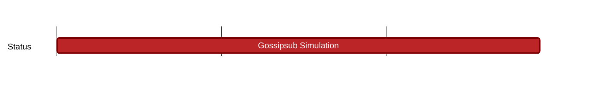

## `vac:dr:gsub-scaling:vac:gossipsub-simulation`
---

- status: 20%
- CC: Farooq

### Description

* simple gossipsub node (in nim) for DST/Wakurtosis simulations
* PoC [shadow](https://github.com/shadow/shadow) simulation

### Justification

### Deliverables

