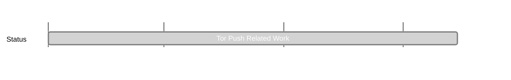

## `vac:dr:valpriv:vac:tor-push-rel-work`
---

- status: 100%
- CC: Umar

### Description

Background and motivation [here](https://ethresear.ch/t/a-tor-based-validator-anonymity-approach-incl-comparison-to-dandelion/14134).

* comprehensive current/related work study on Validator Privacy
  - focus on network layer but also including: network vs consesus layer privacy (SSLE), as well as combinations

### Justification

### Deliverables

