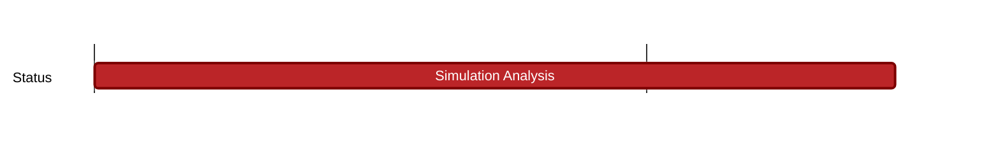

## `vac:dst:analysis:nomos:simulation-analysis`
---

- status: 100%
- CC: Ganesh

### Description

### Justification

### Info

Extended:
* include signature aggregation into analysis
* write analysis section in Carnot paper

* [nomos node](https://github.com/logos-co/nomos-node)
* [nomos simulations](https://github.com/logos-co/nomos-simulations)

### Deliverables

