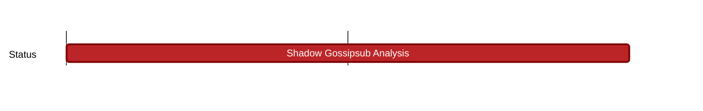

## `vac:dst:analysis-shadow:vac:shadow-gossipsub-analysis`
---

- status: 0%
- CC: Jordi

### Description

* develop a gossipsub node with allows to set desired message rates and other properties
* try to get to a higher node number (50k?)
* research log post

### Justification

### Deliverables

