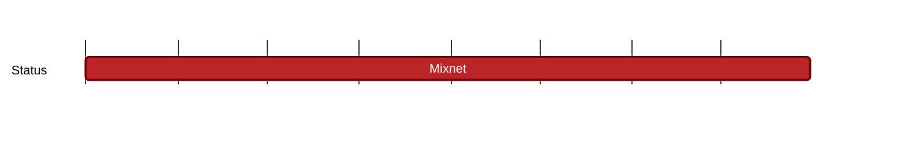

## `vac:dst:deployment-and-analysis:nomos:mixnet`
---

- status: 10%
- CC: Wings

### Description

Assist the Nomos team with deploying and running a mixnet at scale within VacLab.

- Provide analysis of the VacLab mixnet
- Through [Visualiser](../../tooling/vac/visualiser-tool.md), provide visualisation tools and work with the Nomos team to implement privacy preserving metrics and measurements in Nomos to help understand the mixnet's performance.
- Work with the Nomos team to deploy the visualisation tools for their own purposes.

### Justification

### Deliverables
- Lab version of mixnet fully operational and rolled out
- Working metrics via Visualiser Tool