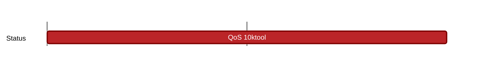

## `vac:dst:eng-10ktool:vac:qos`
---

```mermaid
%%{ 
  init: { 
    'theme': 'base', 
    'themeVariables': { 
      'primaryColor': '#BB2528', 
      'primaryTextColor': '#fff', 
      'primaryBorderColor': '#7C0000', 
      'lineColor': '#F8B229', 
      'secondaryColor': '#006100', 
      'tertiaryColor': '#fff' 
    } 
  } 
}%%
gantt
  tickInterval 1month
  dateFormat YYYY-MM-DD 
  section Status
    QoS 10ktool: 2023-11-01, 2023-12-31
```

- status: 0%
- CC: Alberto

### Description

Add QoS parameter support to the 10k tool.

### Justification

### Deliverables

