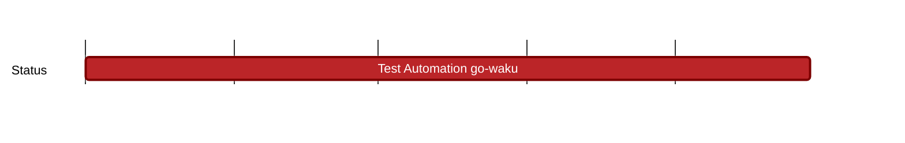

## `vac:dst:software-testing:waku:test-automation-go-waku`
---

- status: 0%
- CC: Roman

### Description

* filter (t) ← first group of tests added in PR to JS waku
* lightpush (t)
* store (t)
* relay
* peer exchange
* discv5
* peer & connection management
* CI integration

### Justification

### Deliverables

