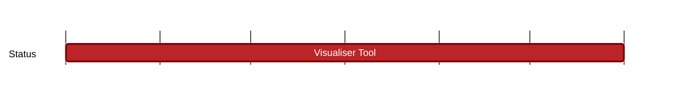
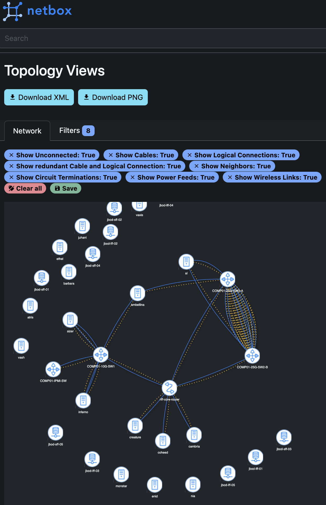

## `vac:dst:tooling:vac:visualiser-tool`
---

- status: 10%
- CC: Alberto

### Description

A first version of tool that allows for visualising the message flow of a Waku network. It should be adaptable to other network types too (particularly Nomos, Codex)

This relies on a Grafana Loki deployment to store and query logs.

### Justification

### Deliverables

A peer to peer network mapper that creates a visualisation something like this:

The tool should be able to visualise the message flow of a Waku network, by lighting up nodes in a graph as they receive messages, flashing a different colour for each message (or message type).