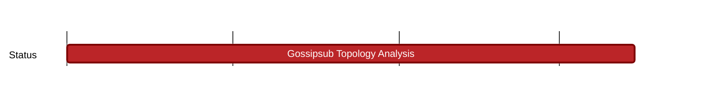

## `vac:dst:wakurtosis:waku:gossipsub-topology-analysis`
---

- status: 60%
- CC: Ganesh

### Description

Analysis of the topology of a gossipsub topic mesh.

Comprises:
* research log post
* shadow integration
* Logos research call talk; also get input during the discussion regarding which areas we should go deeper into, and what would help Logos projects the most.

### Info

Extended deadline because:

 * added research log post to the milestone goals + more analysis goals (e.g stability/dynamics)
 * added analysing simple gossipsub node (in addition to Waku relay)
   - Relevant data has to be collected on the gossipsub-layer which increased the complexity of this milestone
 * shadow integration
 * more focus on nomos simulation analysis + extended analysis

Note: This analysis module will be usable outside of Wakurtosis, too.
This is the reason we continue on this milestone, even though Wakurtosis is deprecated now.

### Justification

### Deliverables

