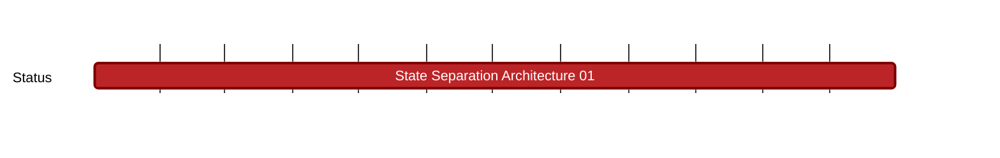

## `vac:nes:state-separation:vac:state-separation-architecture-01`
---

- status: 20%
- CC: Team

### Description

The main goal is to design and refine a sophisticated model of state separation within the Nescience project,
which is aimed at distinctly segregating and managing public and private computational processes, including specialized operations such as shielded and deshielded activities.
This model is focused on improving privacy through the use of Zero-Knowledge Proofs (ZKPs) and overcoming obstacles related to the traceability
and linkability of transactions by employing cutting-edge cryptographic methods and frameworks.
The goal is to create a nuanced architecture that adeptly balances public and private computational needs.
It will utilize an account-based system for public interactions and a UTXO (Unspent Transaction Output)-based method for private transactions,
effectively combining the benefits of public state efficiency and transparency with the strong privacy safeguards of private states.
This effort aims to tackle critical issues in enhancing privacy, engaging deeply with a zero-knowledge virtual machine (zkVM), and achieving significant advances in privacy assurance. 

The Nescience project elevates the concept of state separation to a new level, striking an unparalleled balance between privacy and scalability by enabling simultaneous public and private computations.
Unlike existing initiatives, our model not only integrates these two states but also innovates within the private state to support trusted computing,
achieving scalability without sacrificing privacy. We aim to redefine privacy-oriented technologies,
which are often criticized for their sluggish performance, by introducing a fast, intuitive, and developer-friendly approach to state separation.
Furthermore, we envision the public state serving as a vigilant monitoring layer, safeguarding privacy against any potential ZKP vulnerabilities or attacks,
thereby assuring users of their data security.
Our project distinguishes itself by offering a well-defined theoretical representation of state separation,
complete with graphical analyses for a clearer comparison with other privacy-preserving solutions, thus addressing the lack of specificity and clarity in existing models.

Interactions with the virtual machine (VM) are pivotal, involving two critical junctures.
Initially, on the user (client) side, transactions that may contain multiple executions, including private, shielded, or deshielded types, are generated as ZK proofs.
These proofs, representing each execution, are then amalgamated into a single ZK proof for submission to the sequencer (VM).
The sequencer's role is to aggregate transactions from users, verify the proofs, validate nullifiers for conflict detection,
and then compile all verified proofs within an epoch to formulate a block.
This process also entails adjustments to the public state in response to the varied executions (public modifications, shielded, and deshielded executions).

The design criteria for the zkVM include the necessity for high recursion capabilities and sufficient efficiency to ensure usability in terms of memory and computational time on the user side.
This requirement is critical for compatibility with complex tasks like concealing certain information within zkVM operations,
accommodating a significant volume of public and private inputs. The efficiency of verification, even in systems like Groth16 that offer theoretically constant-size verification times,
can be affected as the quantity of inputs grows, underscoring the need for a VM architecture that remains practical and responsive under varying loads.
This nuanced understanding underscores the project's comprehensive approach to leveraging state separation for enhanced privacy and scalability,
all while ensuring compatibility with an advanced zkVM framework.

The most significant impact of our state separation approach in the Nescience project lies in its innovative privacy features,
which employ an account-based model for the public state and a UTXO-based model for the private state, allowing for individual or group-specific private states.
This method stands out by offering four distinct types of executions: public, private, shielded, and deshielded, each with unique characteristics to maintain privacy and scalability.
Public executions are transparent and swift, modifying accounts without the need for Zero-Knowledge Proofs (ZKPs).
In contrast, private, shielded, and deshielded executions, which involve transferring between public and private states or within private states,
   utilize ZKPs to protect sensitive information like addresses, transaction amounts, and smart contract invocations through kernel circuits.

These executions are further enriched by allowing transactions to comprise various execution types,
ensuring that sensitive data is processed on the user side with ZKPs to prevent exposure in the public state.
For example, transactions involving private tokens or smart contract interactions remain confidential, with minimal information reflected publicly.
This architecture addresses potential risks like linkability and double-spending through the innovative use of nullifiers and accumulators, enhancing privacy without sacrificing security.

Our approach also introduces Private Directed Acyclic Graphs (PDAGs) as a tool for analyzing and enhancing privacy.
As an extension of Transaction Directed Acyclic Graphs (TDAGs), PDAGs are specifically designed to address and measure two critical aspects of privacy:
unlinkability and untraceability. Unlinkability refers to the property that ensures individual transactions cannot be linked to each other,
making it impossible to trace the flow of assets between transactions from an external observer's perspective.
This feature is crucial for protecting user identities and preventing the exposure of transaction histories.
Untraceability, on the other hand, ensures that it is infeasible to trace transactions back to their source or destination,
providing a further layer of privacy by obscuring the relationship between senders and receivers.
This means that, even if an entity were to observe the network, they would not be able to determine the parties involved in any given transaction.
PDAGs incorporate these principles by structuring transaction records in a way that leverages the benefits of directed acyclic graphs (DAGs),
a type of data structure that allows for efficient data management and retrieval without the limitations of linear or hierarchical arrangements.
In the context of blockchain, DAGs enable faster transactions and greater scalability, while PDAGs extend these benefits with a focus on privacy.
By calculating unlinkability and untraceability metrics within a PDAG framework, it becomes possible to quantitatively assess the privacy level of a blockchain network.
This analytical approach allows for comparisons with other privacy-centric solutions, such as CoinJoin, Tornado Cash, and privacy-focused blockchains like Monero and Zcash.
Through PDAGs, developers can identify potential weaknesses in privacy measures and enhance the network's resistance to analysis and tracking, ensuring a secure and private environment for users.
By incorporating decoy inputs in shielded and deshielded transactions, we further obscure the link between public and private states, significantly reducing the risk of privacy breaches.

In essence, the Nescience project's state separation method not only advances privacy and scalability in blockchain technology
but also sets new standards in protecting user data through a sophisticated blend of theoretical models and practical implementations.
This approach not only addresses current privacy concerns but also lays the groundwork for future investigations into efficient and secure private state exchanges.

To provide a structured approach to the development of the advanced State Separation Architecture for the Nescience project,
focusing on privacy enhancement, we can break down the milestone into distinct sub-milestones, each with its own specific work breakdown and deliverables.

### Justification

### Work Breakdown and Deliverables

* Sub Milestone 1 (Q2 2024): Execution Types and Privacy Mechanism Design

  **Work Breakdown:** Define and design the distinct execution types (public, private, shielded, and deshielded) and their respective privacy mechanisms, integrating Zero-Knowledge Proofs (ZKPs) for enhanced privacy.

  **Deliverables:** Set of comprehensive deliverables, including an Execution Type Design Document that offers a detailed examination of the specifications and workflows associated with public, private, shielded, and deshielded executions. Additionally, a Privacy Integration Blueprint will be developed to outline the method by which Zero-Knowledge Proofs (ZKPs) are seamlessly integrated into the Nescience architecture.
  
 * Sub Milestone 2 (Q2 2024): Cryptographic Infrastructure and Nullification Strategy

  **Work Breakdown:** Develop the cryptographic infrastructure necessary for the state separation architecture, including nullifiers and accumulators, to prevent double-spending and ensure unlinkability of notes. First step would be identifying and selecting suitable cryptographic primitives for nullifiers and accumulators, then implementing the selected primitives in the architecture.

  **Deliverables:** A detailed guide on the implementation and integration of nullifiers and accumulators within the state separation model, including their roles in the architecture.
  
* Sub Milestone 3 (Q3 2024): State Separation Doc

  **Intro:** In this milestone, the first part (https://vac.dev/rlog/Nescience-A-zkVM-leveraging-hiding-properties) focuses on conducting detailed exploration of the multifaceted challenges,
potential solutions, and alternatives that lay ahead building Nescience, a privacy-first blockchain project aiming to enable private transactions and provide a general-purpose execution environment 
for classical applications. The second part aims to delve deeper into the selected strategic paths for developing a privacy-first blockchain, detailing the methodologies for addressing the identified challenges, 
the decisions made to enhance privacy, and the expected outcomes.

  **Work Breakdown:** Document all the research findings, the development steps and the methodologies, explaining the utility and adoption process of each solution to reinforce privacy within the project and the shift in focus towards detailing the chosen paths for the project development, including the rationale behind these decisions and their alignment with privacy enhancements. Finally, Review future directions, potential areas of research, and ongoing development efforts to continue advancing privacy within the Nescience project

 **Deliverables:**  Blog posts and/or scientific papers. 

 **Impact:** By clearly articulating the exploration from identifying challenges to implementing solutions,
Part Two of the State Separation Document aims to serve as a comprehensive guide and reference for enhancing privacy in blockchain technologies,
marking a significant milestone in the Nescience project's development.

  
* Sub Milestone 4 (Q3 2024): Enhancing Transaction Privacy with Decoy Inputs

  **Work Breakdown:** Incorporate empty notes as decoy inputs for shielded and deshielded executions to enhance the untraceability and unlinkability of transactions. First we aim to design the mechanism for integrating decoy inputs into transactions to act as noise; then we develop a prototype that demonstrates the effectiveness of decoy inputs in enhancing transaction privacy.

  **Deliverables:** A prototype showcasing the implementation of decoy inputs, accompanied by evaluation results highlighting their impact on privacy enhancement.
  
* Sub Milestone 5 (Q4 2024): Nescience devnet deployment

  **Work Breakdown:** Deploy a Nescience Devnet by integrating simplified components into the zkVM and state separation architecture to achieve a fully functional Nescience environment. Add the necessary simplified components to the zkVM and state separation architecture such as P2P communication layer, Consensus layer, and Network layer. Focus on node deployment (Configure and start Nescience nodes on designated machines and ensure nodes operate independently, with a full structure that includes the consensus layer, network layer, etc.). Ideally, the Nescience Devnet should function autonomously, without reliance on external blockchain environments whereas existing components can be utilized ensuring that the system should be able to run on its own.
 
  **Deliverables:** A fully operational Nescience Devnet, capable of running nodes independently with integrated P2P communication, consensus, and network layers, all within the zkVM and state separation framework.
  
 

### Risks

We currently have 2 open positions for hiring a 1) Zero Knowledge Research Engineer and a 2) Zero Knowledge Researcher.
Currently we are finding some difficulties in finding the best candidates for these positions and therefore we need to consume Vac resources (namely Ugur and Marvin) for a longer time to focus on Nescience projects.

