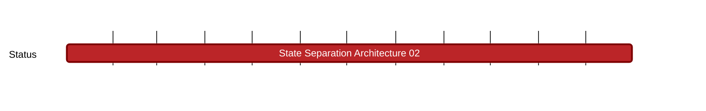

## `vac:nes:state-separation:vac:state-separation-architecture-02`
---

- status: 0%
- CC: Team

### Description

contiunation of `vac:nes:state-separation:vac:state-separation-architecture-02`

### Justification

### Work Breakdown and Deliverables

* Sub Milestone 1 (2025): TDAG & PDAG Integration for Privacy Enhancement 

  **Work Breakdown:** Use Transaction Directed Acyclic Graphs (TDAGS) and Private Directed Acyclic Graphs (PDAGs) for a comparative analysis of the Nescience architecture's privacy features. The main idea is to implement PDAGs to improve unlinkability and untraceability within the project, enhancing privacy features. This can be done by developing and integrating PDAG structure, oncluding data structures, algorithms and the integration mechanism with the existing system; by conducting thorough testing of the PDAG implementation to identify issues or areas of improvements; and by monitoring its performance and impact on privacy enhancement.

  **Deliverables:**
    * Report on PDAG reearch and analysis.
    * PDAG integration technical specifications and design documents.
    * A functioning PDAG implementation with testing reports.
    * Documentation on PDAG privacy improvements and security analysis.

* Sub Milestone 2 (2025): Kernel-based Architecture Implementation

  **Work Breakdown:** Develop a kernel-based framework for verifying private function executions accurately, using a recursive SNARKs approach to build and validate a call stack. This is to ensure robust proof of execution sacrificing computational resources (raising gas fees due to the intensive nature of generating SNARK proofs and handling recursive computations). We will focus on balancing the precision of recursive verification with its computational costs, aiming for a system that guarantees the integrity of private functions while managing resource use efficiently.

  **Deliverables:** 
   * A data structure to manage recursive function calls, ensuring efficiency and security.
   * A system to securely accumulate and manage proof data for recursive calls, facilitating tamper-resistant proof handling.
   * Generation of intermediary SNARK proofs for each recursive call, with aggregation capabilities for comprehensive stack validation.
   * Establishment of a maximum recursion depth with enforcement mechanisms to prevent computational overflow.
   * A fully integrated recursive verification system with extensive testing to ensure functionality, security, and performance under varied conditions.
  
* Sub Milestone 3 (2025): Seamless Interaction Design

  **Work Breakdown:** Address the challenge of potential information leakage between private and public transactions by ensuring composability between contracts and secure integration of functions. Moreover, we would like to be able to create secure channels for contract composability and interaction layers that prevent private data exposure by implementing strategic safeguards against information leakage.

  **Deliverables:** 
   * Intermediary smart contracts for secure public-private interactions.
   * Confidential sidechains and cross-chain protocols employement.
   * Fragmentation of data across shards for private interaction.
  

* Sub Milestone 4 (2025 / 2026): zkVM deployment

   **Work Breakdown:**  Our aim is to deploy our work in progress state separation architecture within a privacy-first zero knowledge virtual machine since it places an emphasis on privacy enhancements (which we need for our privacy-first zkVM).
    
    **Deliverables:** A functioning privacy-first zkVM that ensures that while private state data remains undisclosed, public state transitions can still be carried out and subsequently verified by third parties.

### Risks

