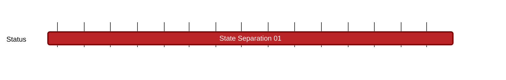

## `vac:nes:state-separation:vac:state-separation-doc-01`
---

- status: 50%
- CC: Moudy

### Description

Document explaining and providing reason for Nescience state separation.

In this milestone, the first part (https://vac.dev/rlog/Nescience-A-zkVM-leveraging-hiding-properties) focuses on conducting detailed exploration of the multifaceted challenges,
potential solutions, and alternatives that lay ahead building Nescience, a privacy-first blockchain project aiming to enable private transactions and provide a general-purpose execution environment for classical applications.
The second part aims to delve deeper into the selected strategic paths for developing a privacy-first blockchain,
detailing the methodologies for addressing the identified challenges, the decisions made to enhance privacy, and the expected outcomes.

### Justification

### Work Breakdown

* Document all the research findings, the development steps and the methodologies.
* Explain the utility and adoption process of each solution to reinforce privacy within the project
* Explain the shift in focus towards detailing the chosen paths for the project development, including the rationale behind these decisions and their alignment with privacy enhancements.
* Review future directions, potential areas of research, and ongoing development efforts to continue advancing privacy within the Nescience project

### Risks

We currently have 2 open positions for hiring a 1) Zero Knowledge Research Engineer and a 2) Zero Knowledge Researcher. 
Currently we are fiding some difficulties in finding the best candidates for these positions and therefore we need to consume Vac resources (namely Ugur and Marvin) for a longer time to focus on Nescience projects.

### Deliverables

* Blog posts.
* Scientific papers. 

**Impact:** By clearly articulating the exploration from identifying challenges to implementing solutions,
Part Two of the State Separation Document aims to serve as a comprehensive guide and reference for enhancing privacy in blockchain technologies,
marking a significant milestone in the Nescience project's development.

