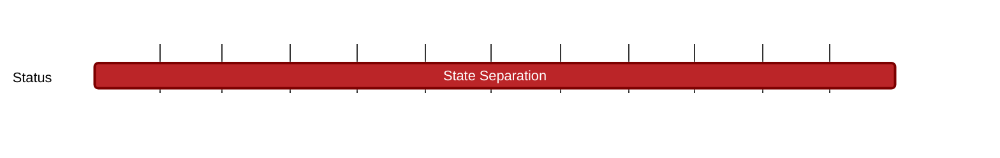

## `vac:nes:state-separation:vac:state-separation-doc-02`
---

- status: 0%
- CC: Moudy

### Description

This open milestone is crucial for ensuring that our development aligns with the evolving needs and expectations of users and organization.
We aim not only to address the immediate challenges of developing a privacy-first blockchain but also to lay the groundwork for future innovations in blockchain privacy and security.

Note: This is an ongoing and long term milestone with possible deliveries within the year 2024.
The timing and nature of these deliveries are contingent upon our continuous findings and their subsequent impact on privacy for both the organization and the community.

### Justification

### Work Breakdown

* Document all the research findings, the development steps and the methodologies.
* Explain the utility and adoption process of each solution to reinforce privacy within the project
* Explain the shift in focus towards detailing the chosen paths for the project development, including the rationale behind these decisions and their alignment with privacy enhancements.
* Review future directions, potential areas of research, and ongoing development efforts to continue advancing privacy within the Nescience project

### Deliverables

* Blog posts.
* Scientific papers. 

