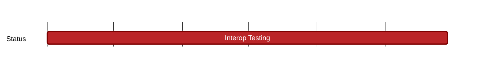

## `vac:qa::interop-testing`
---

- status: 30%
- CC: Florin, Roman

### Description

* filter
* lightpush
* store
* relay
* peer exchange
* discv5
* peer & connection management
* filter nwaku service node + js waku client node
* nwaku <> go-waku interop
* ci integrations
* nightly reports

### Justification

### Deliverables

