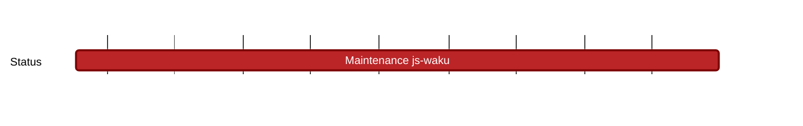

## `vac:qa::waku:maintenance-js-waku`
---

- status: 0%
- CC: Florin

### Description

This milestone serves as a placeholder for various tasks essential to maintaining and enhancing our project's operational efficiency. 

It is specifically designated for updates and fixes to tests that were introduced in previously closed milestones, ensuring that all our testing frameworks remain robust and up-to-date. 

It also offers a space for small, ad-hoc developer requests, for instance, we can use this milestone when we are requested assistance with reproducing steps for a bug or to conduct an investigation into a specific failure.

### Justification

### Deliverables

