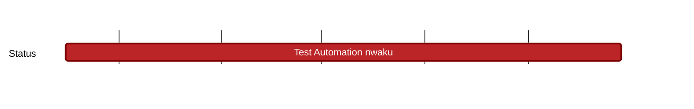

## `vac:qa::waku:test-automation-nwaku`
---

- status: 70%
- CC: Alex

### Description

* filter (t)
* lightpush (t)
* store (t)
* relay
* peer exchange
* discv5
* peer & connection management
* CI integration

### Justification

### Deliverables
