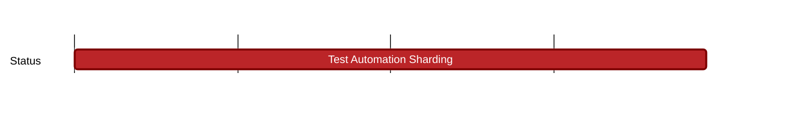

## `vac:qa::waku:test-automation-sharding`
---

- status: 50%
- CC: Roman, Florin, Alex

### Description

* nwaku unit tests
* gowaku unit tests
* js-waku unit tests
* interop sharding tests

### Justification

### Deliverables
