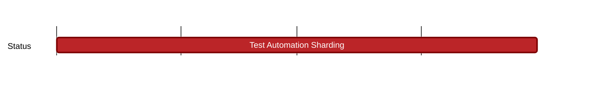

## `vac:qa::waku:test-automation-sharding`
---

- status: 50%
- CC: Roman, Florin, Alex

### Description

* nwaku unit tests
* gowaku unit tests
* js-waku unit tests
* interop sharding tests

### Justification

### Deliverables
- gowaku:
  - https://github.com/waku-org/go-waku/commit/a453c027b71cbf8d1b01d009e769d1b7d0faa8b5

- interop:
  - https://github.com/waku-org/waku-interop-tests/tree/master/tests/sharding

- js-waku:
  - https://github.com/waku-org/js-waku/tree/master/packages/tests/tests/sharding
  - https://github.com/waku-org/js-waku/blob/master/packages/utils/src/common/sharding.spec.ts

- nwaku:
  - https://github.com/waku-org/nwaku/pull/2603
