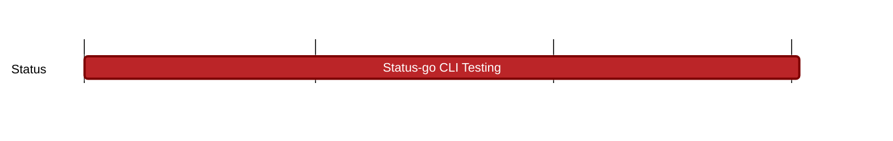

## `vac:qa::waku:status-go-cli-testing`
---

- status: 0%
- CC: Florin

### Description

* Testing the reliability of message sending via the status-go CLI tool. See [details](https://docs.google.com/document/d/1L8HvXtAYk-JqQL6w3RgCskXwegcTa0J5nyH9YL4LrQE/edit#heading=h.q8bx3xjzsxn9) 
* [Ticket](https://github.com/status-im/status-go/issues/5144)
* Potential [tool](https://github.com/status-im/status-go/blob/develop/cmd/status-cli/README.md) to use
  
### Justification

### Deliverables
