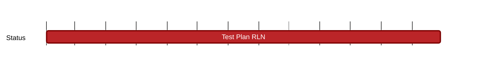

## `vac:qa::waku:test-plan-rln`
---

- status: 100%
- CC: Florin

### Description

Test plan for the Waku RLN relay.

### Justification

### Deliverables

* [RLN Relay test plan](https://www.notion.so/RLN-Relay-9dd36da3029847aa86dda2cb4ccbc145)
