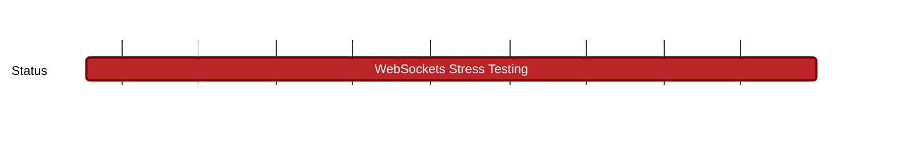

## `vac:qa::waku:ws-stress-testing`
---

- status: 0%
- CC: Florin, Roman

### Description

[WIP] : This milestone is designated as a specific request from the Waku Team, focusing on conducting a stress test to evaluate the robustness and reliability of the nim-websocket implementation versus HTTP. 

(more info will be added once the Waku 2024 milestones are finalized)

### Justification

### Deliverables
