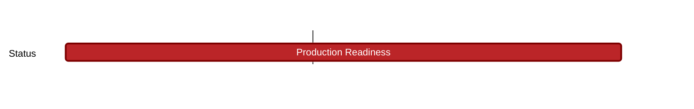

## `vac:sc::status:community-curation-dapp-contracts`
---

- status: 100%
- CC: Ricardo

### Description

Depends on finishing  [[ vac/sc/g/status/snt-optimism-bridge | SNT-optimism-bridge ]]

The milestone has to be completed (can be a mitigation / preliminary fix):

* https://github.com/status-im/community-dapp/issues/64
* https://github.com/status-im/community-dapp/issues/65

#### Info

This milestone comprises what the SC has to deliver towards the completion of Status No2 prio:

`2) if any further work needs to be done on the Community Directory Curation dApp for the initial launch this is second priority`

### Justification

### Deliverables

