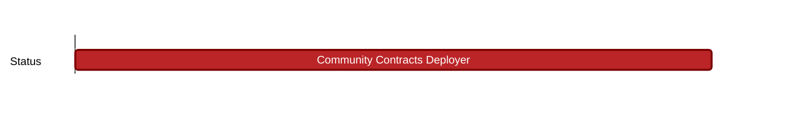

## `vac:sc::status:community-contracts-deployer`
---



- status: 100%
- CC: r4bbit

### Description


### Justification


### Deliverables

* https://github.com/status-im/communities-contracts/commit/e7d799b761e87166ecee4efaaede0b7a6cc367ad

* https://goerli-optimism.etherscan.io/address/0xfFa8A255D905c909379859eA45B959D090DDC2d4

Test-net addresses:

```
CommunityTokenDeployer 0xfFa8A255D905c909379859eA45B959D090DDC2d4
CommunityOwnerTokenRegistry 0x99F0Eeb7E9F1Da6CA9DDf77dD7810B665FD85750
CommunityOwnerTokenFactory 0x76d0E484e7c3398922636960Ab33bDe6E9936D81
CommunityMasterTokenFactory 0x420BE6568c6E09782CEAE1575495Cd6C1c7EA04D
```


