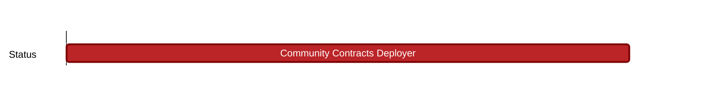

## `vac:sc::status:community-contracts-deployer`
---



- status: 100%
- CC: r4bbit

### Description


### Justification


### Deliverables

* https://github.com/status-im/communities-contracts/commit/e7d799b761e87166ecee4efaaede0b7a6cc367ad

Test net:

```
0: contract CommunityTokenDeployer 0x7Ff554af5b6624db2135E4364F416d1D397f43e6
1: contract CommunityOwnerTokenRegistry 0x9C84f9f9970B22E67f1B2BE46ABb1C09741FF7d7
2: contract CommunityOwnerTokenFactory 0x0B5DAd18B8791ddb24252B433ec4f21f9e6e5Ed0
3: contract CommunityMasterTokenFactory 0x35Cded11D75cC10d38ED4456b8caDC9F36E85E42
```

* https://goerli-optimism.etherscan.io/address/0x7Ff554af5b6624db2135E4364F416d1D397f43e6


