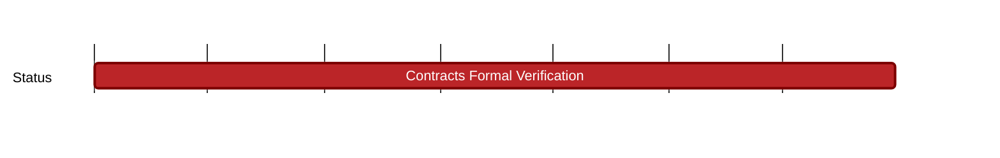

## `vac:sc::status:ens-usernames-maintenance`
---

- status: 0%
- CC: Ricardo, r4bbit

### Description

Maintaining and deploying the [ens-usernames smart contracts](https://github.com/status-im/ens-usernames), as well as ensuring their code is up to date.

### Justification
### Deliverables

