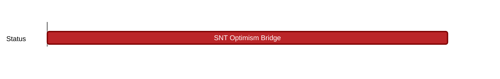

## `vac:sc::status:snt-optimism-bridge`
---

- status: 70%
- CC: Ricardo

### Description

This milestone comprises issues that have to be completed to bridge SNT to Optimism.
These issues are part of enhancing the MimiMe token.

* https://github.com/vacp2p/minime/issues/19
* https://github.com/vacp2p/minime/issues/17
* https://github.com/vacp2p/minime/issues/7
* https://github.com/vacp2p/minime/issues/5
* https://github.com/vacp2p/minime/issues/20

Following enhancments to the MimiMe token (future work) are tracked in:
[[ vac/sc/g/status/mimime-token-enhancement | mimime-token-enhancement ]]

### Justification

### Deliverables

