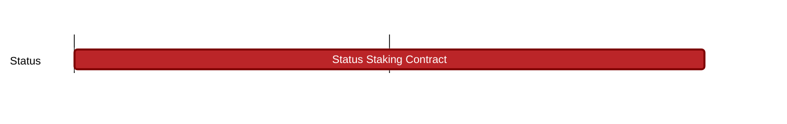

## `vac:sc::status:staking-contract_02`
G

- status: 10%
- CC: Ricardo

### Description

This milestone comprises a set of improvements on and extensions to the current state of the staking contract  [[staking-contract| staking-contract]].

Details can be found here: https://www.notion.so/Implementing-SNT-Staking-Contract-Issues-Differences-2de74e7c19124e78b1c9490300a84422
This document is the basis for the following issues:

* https://github.com/logos-co/staking/issues/9
* https://github.com/logos-co/staking/issues/10
* https://github.com/logos-co/staking/issues/11
* https://github.com/logos-co/staking/issues/12
* https://github.com/logos-co/staking/issues/13
* https://github.com/logos-co/staking/issues/14
* https://github.com/logos-co/staking/issues/15
* https://github.com/logos-co/staking/issues/16
* https://github.com/logos-co/staking/issues/17
* https://github.com/logos-co/staking/issues/18

The milestone is achived when these issues have been resolved.

#### Info

This milestone comprises what the SC has to deliver towards the completion of Status No1 prio:

`the SNT contract for deployment on Optimism is top priority`

### Justification

### Deliverables

