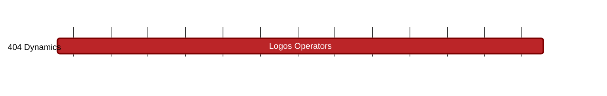

### `vac:tke::404:logos-operators`
---

- status: 5%
- CC: Martin, Juan

### Description
Assist with the development of the points-based reward system.

### Justification
These are the minimum requirements to build an MVP of the game.

### Deliverables
- Reports with each of the analyses

### Tracking Metrics
- Timely delivery of the reports
- Timely launching of the MVP
- Agreement with 404 Dynamics team and stakeholders

### Work breakdown
- Definition of a points-based system
- Pricing Mechanisms for Operators NFTs
- Analysis of Incentives

### Perceived Risks
Technical and legal constraints
