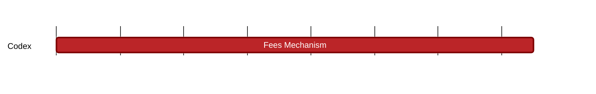

### `vac:tke::codex:cdx-fees`
---

- status: 0%
- CC: Frederico

### Description
Understand the mechanisms to implement protocol fees, e.g. burn-and-mint equilibrium model;

### Justification
Value capture mechanism.

