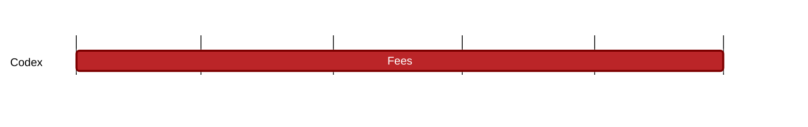

### `vac:tke::codex:cdx-fees`
---

- status: 90%
- CC: Frederico

### Description
Understand the mechanisms to implement protocol fees, e.g. burn-and-mint equilibrium model;

### Justification
Understand the security of the system. As part of the Codex Technical Milestone #5 ("Tokenomics").

### Deliverables
- Three chapters of the Codex Litepaper (Use Cases, Contract Lifecycle, and CDX Tokenomics)
- One section of the Codex Whitepaper (CDX Tokenomics)

### Tracking Metrics
Completion of the respective sections in the Codex Litepaper and Whitepaper.

### Work breakdown
Definition of value accrual, capture and incentive mechanisms of the Codex protocol.

### Perceived Risks
Technical and legal constraints.