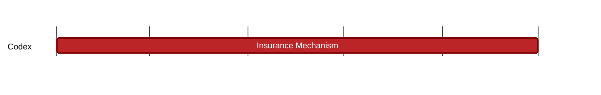

### `vac:tke::codex:cdx-insurance`
---

- status: 40%
- CC: Frederico, Juan

### Description
Mechanisms to make the system more stable

### Justification
Understand the roles that impact the performance and security of the protocol. As part of the Codex Technical Milestone #5 ("Tokenomics").

### Resources Required
1 CC working at 50% rate; no external service or special infrastructure required.

### Deliverables
- Three chapters of the Codex Litepaper (Use Cases, Contract Lifecycle, and CDX Tokenomics)
- One section of the Codex Whitepaper (CDX Tokenomics)

### Tracking Metrics
Completion of the respective sections in the Codex Litepaper and Whitepaper.

### Work breakdown
- Definition of insurance role.
- Analysis of CDX impact on system security. 
- Comparison against protocols which don’t have any embeeded stabilization mechanism.

### Perceived Risks
Technical and legal constraints.