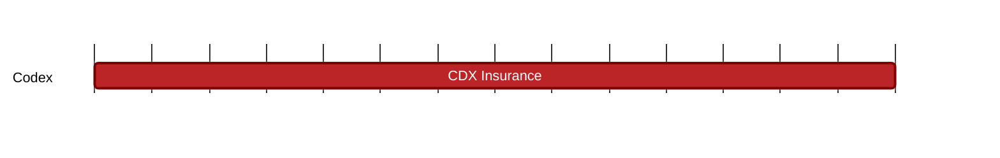

### `vac:tke::codex:cdx-insurance`
---

```mermaid
%%{ 
  init: { 
    'theme': 'base', 
    'themeVariables': { 
      'primaryColor': '#BB2528', 
      'primaryTextColor': '#fff', 
      'primaryBorderColor': '#7C0000', 
      'lineColor': '#F8B229', 
      'secondaryColor': '#006100', 
      'tertiaryColor': '#fff' 
    } 
  } 
}%%
gantt
	dateFormat YYYY-MM-DD
	section Codex
		CDX Insurance :, 2024-03-01, 2024-03-15
```

- status: 0%
- CC: Frederico

### Description
Mechanisms to make the system more stable

### Justification
Understand the economic security of the protocol

