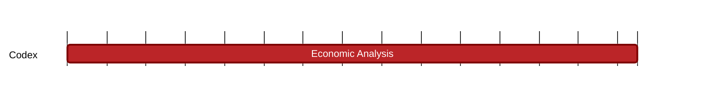

### `vac:tke::codex:cdx`
---

- status: 50%
- CC: Frederico

### Description
Codex token as utility token for all participants (collateral and payment), impact on system security.

### Justification
Token to coordinate the market place.

