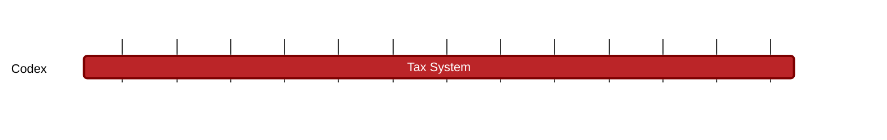

### `vac:tke::codex:contract-defaults`
---

- status: 0%
- CC: Frederico

### Description
Design of the systemic slashing mechanism.

### Justification
As part of Codex Technical Milestones #3 ("Marketplace Interactions").

### Resources Required
- 1 CC working at 50% rate
- no external service required
- no special infrastructure required

### Deliverables
- Modeling and Simulations
- Report 

### Tracking Metrics
- Timely delivery of the report
- Agreement with Codex team and stakeholders

### Work breakdown
- Review consequences for SPs, Clients and PAs
- Economic and game theoretical analysis of these consequences

### Perceived Risks
Technical and legal constraints.
