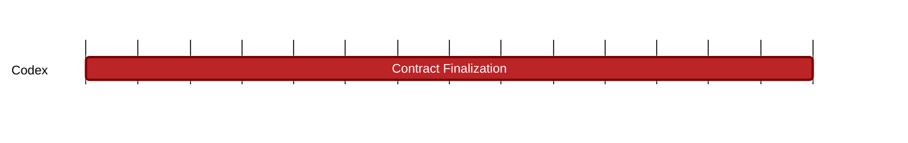

### `vac:tke::codex:contract-finalization`
---

- status: 0%
- CC: Frederico

### Description
SPs & Users obligations, data retrieval incentives, collateral retrieval, contract extension.

### Justification
As part of the contract finalization process.
