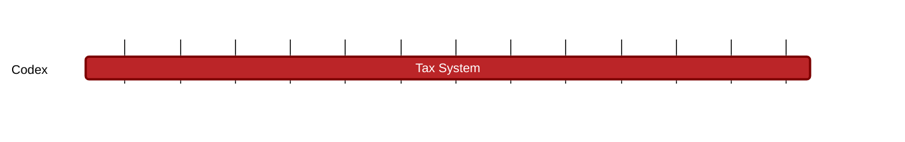

### `vac:tke::codex:contract-finalization`
---

- status: 0%
- CC: Frederico

### Description
SPs & Users obligations, data retrieval incentives, collateral retrieval, contract extension.

### Justification
As part of the contract finalization process. As part of Codex Technical Milestones #3 ("Marketplace Interactions").

### Resources Required
- 1 CC working at 50% rate
- no external service required
- no special infrastructure required

### Deliverables
- Modeling and Simulations
- Report 

### Tracking Metrics
- Timely delivery of the report
- Agreement with Codex team and stakeholders

### Work breakdown

### Perceived Risks
Technical and legal constraints.

