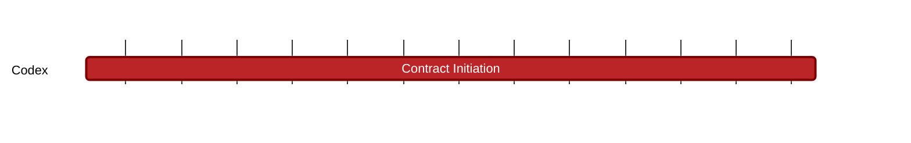

### `vac:tke::codex:contract-initiation`
---

- status: 0%
- CC: Frederico

### Description
Mechanics of Codex contract initiation.

### Justification
As part of Codex Technical Milestones #3 ("Marketplace Interactions").

### Resources Required
- 1 CC working at 50% rate
- no external service required
- no special infrastructure required

### Deliverables
- Modeling and Simulations
- Report 

### Tracking Metrics
- Timely delivery of the report
- Agreement with Codex team and stakeholders

### Work breakdown
- Definition of default settings
- Facilitate the matching of pricing and collateral size
- Analysis of client payment (full vs. partial upfront)
- Analysis of potential gamifications and penalties

### Perceived Risks
Technical and legal constraints.
