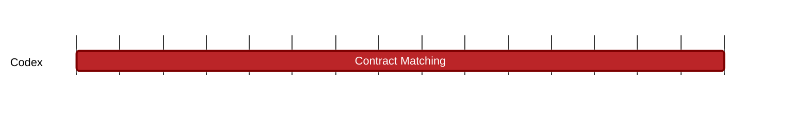

### `vac:tke::codex:contract-matching`
---

- status: 0%
- CC: Matty

### Description
Define what triggers the auction recovery mechanism.

### Justification
As part of the slot recovery mechanism.
