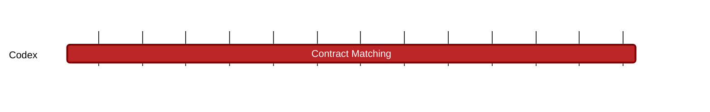

### `vac:tke::codex:contract-matching`
---

- status: 0%
- CC: Frederico

### Description
Define how slots are reserved and filled.

### Justification
As part of the slot reservation mechanism. As part of Codex Technical Milestones #3 ("Marketplace Interactions").

### Resources Required
- 1 CC working at 50% rate
- no external service required
- no special infrastructure required

### Deliverables
- Modeling and Simulations
- Report 

### Tracking Metrics
- Timely delivery of the report
- Agreement with Codex team and stakeholders

### Work breakdown
- Economics and game theoretical analysis of the Slot Reservation Mechanism

### Perceived Risks
Technical and legal constraints.
