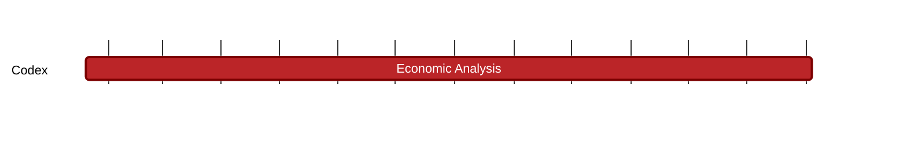

### `vac:tke::codex:economic-analysis`
---

- status: 100%
- CC: Matty, Frederico, Martin

### Description
Codex economic analysis, Codex token utility, Codex collateral management

### Justification
Per Dimitry and Jesse, required by Codex team for completing implementation of system and planning launch

