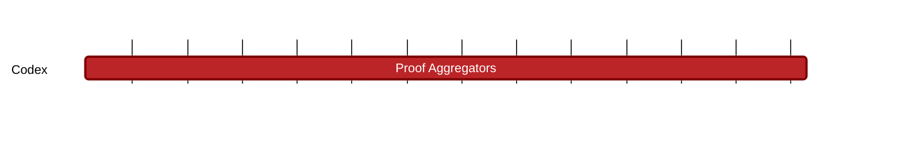

### `vac:tke::codex:proof-aggregators`
---

- status: 10%
- CC: Frederico

### Description
Economics of the proof aggregator (incentives, costs, pricing).

### Justification
As part of Codex Technical Milestones #1 ("Proof Aggregation") and #2 ("Aggregator Network").

### Deliverables
- Modeling and Simulations of the Proof Aggregator actor and process
- One section of the Codex Litepaper "Modeling" chapter (the milestones [contract-initiation](contract-initiation.md), [contract-matching](contract-matching.md), [contract-defaults](contract-defaults.md), [contract-finalization](contract-finalization.md), [recovery-auction](recovery-auction.md), [slot-repair](slot-repair.md), and [tax-system](tax-system.md) cover the remaining parts of this chapter).

### Tracking Metrics
- Timely delivery of the report
- Agreement with Codex team and stakeholders

### Work breakdown
- Definition of the Proof Aggregator role
- Analysis of PA costs and pricing
- Definition of the Proof Aggregation economy
- Analysis of the interactions between PAs

### Perceived Risks
Technical and legal constraints.
