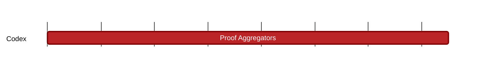

### `vac:tke::codex:proof-aggregators`
---

```mermaid
%%{ 
  init: { 
    'theme': 'base', 
    'themeVariables': { 
      'primaryColor': '#BB2528', 
      'primaryTextColor': '#fff', 
      'primaryBorderColor': '#7C0000', 
      'lineColor': '#F8B229', 
      'secondaryColor': '#006100', 
      'tertiaryColor': '#fff' 
    } 
  } 
}%%
gantt
	dateFormat YYYY-MM-DD
	section Codex
		Proof Aggregators :, 2024-06-15, 2024-06-30
```

- status: 0%
- CC: Frederico

### Description
Economics of the proof aggregator (incentives, costs, pricing).

### Justification
