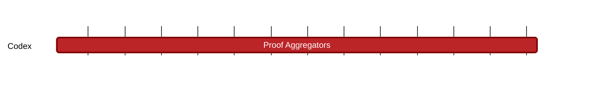

### `vac:tke::codex:proof-aggregators`
---

- status: 10%
- CC: Frederico

### Description
Economics of the proof aggregator (incentives, costs, pricing).

### Justification
As part of Codex Technical Milestones #1 ("Proof Aggregation") and #2 ("Aggregator Network").

### Deliverables
- Modeling and Simulations
- Report 

### Tracking Metrics
- Timely delivery of the report
- Agreement with Codex team and stakeholders

### Work breakdown
- Definition of the Proof Aggregator role
- Analysis of PA costs and pricing
- Definition of the Proof Aggregation economy
- Analysis of the interactions between PAs

### Perceived Risks
Technical and legal constraints.
