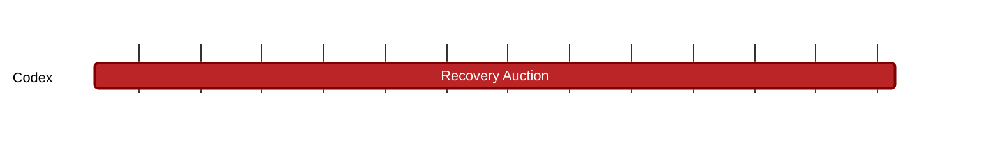

### `vac:tke::codex:recovery-auction`
---

- status: 0%
- CC: Frederico

### Description
Define details of the auction mechanisms for the slot recovery.

### Justification
As part of Codex Technical Milestones #6 ("Data Repair").

### Resources Required
- 1 CC working at 50% rate
- no external service required
- no special infrastructure required

### Deliverables
- Modeling and Simulations
- Report 

### Tracking Metrics
- Timely delivery of the report
- Agreement with Codex team and stakeholders

### Work breakdown
- Define what triggers and ends the auction recovery mechanism
- Design the Dutch Auction
- Evaluate impact on CDX price stability

### Perceived Risks
Technical and legal constraints.
